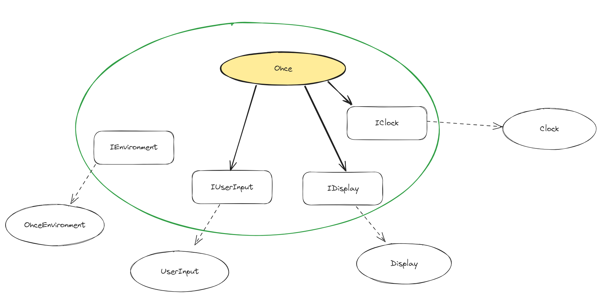

# OhceKata

**Ohce** is a console application that echoes the reverse of what you input through the console.

Even though it seems a silly application, **ohce** knows a thing or two.

1. When you start oche, it greets you differently depending on the current time, but only in Spanish:
    - Between 20:00 and 6:00 hours, **ohce** will greet you saying: _¡Buenas noches < your name >!_
    - Between 6:00 and 12:00 hours, **ohce** will greet you saying: _¡Buenos días < your name >!_
    - Between 12:00 and 20:00 hours, **ohce** will greet you saying: _¡Buenas tardes < your name >!_
2. When you introduce a palindrome, **ohce** likes it and after reverse-echoing it, it adds _¡Bonita palabra!_
3. **ohce** knows when to stop, you just have to write _Stop!_ and it’ll answer _Adios < your name >_ and end.

This is an example of using **ohce** during the morning:

```
$ ohce Pedro
> ¡Buenos días Pedro!
$ hola
> aloh
$ oto
> oto
> ¡Bonita palabra!
$ stop
> pots
$ Stop!
> Adios Pedro
```

#### Lista de tests (Specification-based testing)

```c#

//INVARIANTES
- La respuesta es siempre en castellano (?)

//INPUTS
input: string(nombre usuario)                     --> output: string(saludo con el nombre del usuario)
input: string(palabra introducida por el usuario) --> output: string(palabra invertida)

//COMPORTAMIENTOS
Bien definidos en la propia descripción de la Kata

//PARTICIONES y BOUNDARIES
P1: Inputs [userName] 
	a. hour >= 20:00 && hour < 6:00  --> "¡Buenas noches <userName>!"
		onpoint: 20:00
			offpoint: 19:59
		onpoint: 05:59
			offpoint: 6:00
		 
	b. hour >= 6:00 && hour < 12:00  --> "¡Buenos días <userName>!"
		onpoint: 6:00
			offpoint: 05:59
		onpoint: 11:59
			offpoint: 12:00
		
	c. hour >= 12:00 && hour < 20:00 --> "¡Buenas tardes <userName>!"
		onpoint: 12:00
			offpoint: 11:59
		onpoint: 19:59
			offpoint: 20:00

P2. Inputs [word]
	a. not palindromo --> invertir palabra
	b. palindromo     --> invertir palabra y "¡Bonita palabra!"
	c. "Stop!"        --> "Adios <userName>" y finaliza el programa

//LISTA DE EJEMPLOS (no repetidos basados en particiones/boundaries)
["Manuel"] --06:00-> "¡Buenos días Manuel!"
["Manuel"] --11:59-> "¡Buenos días Manuel!"
["Manuel"] --12:00-> "¡Buenas tardes Manuel!"
["Manuel"] --19:59-> "¡Buenas tardes Manuel!"
["Manuel"] --20:00-> "¡Buenas noches Manuel!"
["Manuel"] --05:59-> "¡Buenas noches Manuel!"

["radar"] ---> "radar" ("¡Bonita palabra!")
["coche"] ---> "ehcoc"
["stop!"] ---> "!pots"  (el comando no se reconoce porque debe ser case-sensitive)
["Stop!"] ---> "Adios Manuel" y finaliza el programa.

["how are you?"] ---> "Debes introducir una sola palabra"
```

#### Colaboradores 



- **IUserInput:** Maneja la entrada de datos del usuario
- **IDisplay:** Maneja la pantalla para mostrar los mensajes al usuario.
- **IClock:** proporciona metodos para recuperar datos de fecha actual etc
- **IEnvironment:** proporciona metodos para manejar el cierre de la aplicacion